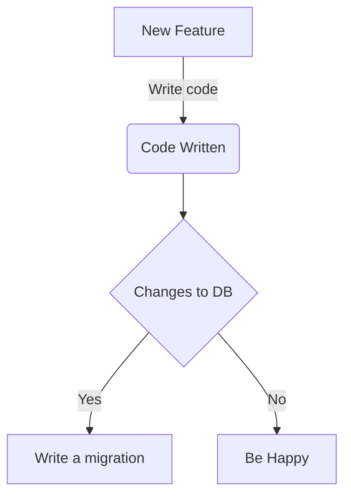

## What are they?

Today I am planning to tackle the tricky subject of database migrations. But this assumes working knowledge of databases in general and it will try to highlight some strategies I use when faced with the need for a migration. So what are they? A migration means you are trying to go from place A to place B. A database migration means we are introducing a change either to the schema i.e how the database is structured or we are updating (or deleting or adding) the content that resides in the database.  Examples below.

1. Schema migration: Adding a column, adding an index or (**god forbid**) dropping a table.
2. Data migration: There is a flag (it's always a flag) and we need to set that value to true for all rows in a table.

Ok so where is tricky bit?

## The tricky bit

Databases are an external entity that your code interacts with which can be managed by your code (say something like Django) but it's still **outside** the code you are writing. It has it's own state, limitations and complexities. 

On a more serious note, almost all changes require the database to change, because you probably need to store something new (because we are always adding new things in the effort to consume even more and oh what's the point of anything). Code is constantly updated so it breaks often but breaking your database is far riskier because well then you will need to rely on a backup so you might lose some data (aka data loss) but data is easy, rolling back a schema change is far more dangerous.

### Common problems
Only some of the things I have encountered

1. Rolling back after a *schema* migration that breaks backwards compatibility. DB schema is updated but code has been rolled back.
2. Alterations that take time in migrations such as adding an index or running an expensive query.
3. Removing "unused" tables

## Solutions (kind of)

Slow but safe is usually best.

### Solution to #1:
1. Ensure that old code is compatible with new schema *before* deployment. This can be done as part of your CI or manually if need be. You should leverage a comprehensive test suite to be safe.
2. When you add new fields always ensure they are nullable with default values where possible.
3. Leverage reverse and forward operations that your ORM can take care of rolling back on your behalf.

Code changes often so it's best and easier to make that the most flexible part of the chain. Assume optionality when building new things, safe guard your assumptions and write tests. If you rollback the worst that will happen is that a new feature isn't released instead of you know losing an hour of production data or bricking the app completely.

### Solution to #2:
1. You can always deploy without migrating ensuring that you can run expensive operations within a maintenance window so as not to affect users.
2. It is best to have a estimation how long this will take beforehand, this can be done by checking number of rows affected for instance. Be careful not to conflate doing this is in a staging environment with doing in it production. Often in staging environments you have very little or very clean data where as production can get **messy**
3. Batch your operations (sensible batch size please)
4. Decide beforehand if you need your transaction to be atomic or if a partial update is safe.
5. Ensure you are able to monitor. "Oh I started a massive job but it seems to have disappeared" "Oh database is at 100% CPU". 

The idea here is that you ensure you suffer no downtime so plan long running operations and ensure that you can be around to monitor.

### Solution to #3
1. Remove all code references and ensure that it lives on production for sometime *before* dropping *anything*. I mean this goes without saying but sometimes it's hard to see that something is still in use. May be it's part of an external API and you aren't sure that's being used still (lack of monitoring) or perhaps it's being used without a proper code reference or some nightly script that no one knows about uses it.
2. Mark those fields as deprecated to warn your fellow team mates.
3. Drop the tables or the fields and *pray*

This is a hard thankless job. Removing things can often reveal they are in fact important. It's often messy though but you do get the reward of a merge request with a nice stat of lines removed to offset the brand new feature you just built! 

## General Strategy

It's best to be prepared for the worst to happen.
1. Don't ignore migration warnings.
3. Ensure a backup of the database is taken immediately before migrating.
4. Ensure that you can monitor events effectively
5. Plan it at a time that's good for you
6. You can write tests for them! And you really should.
